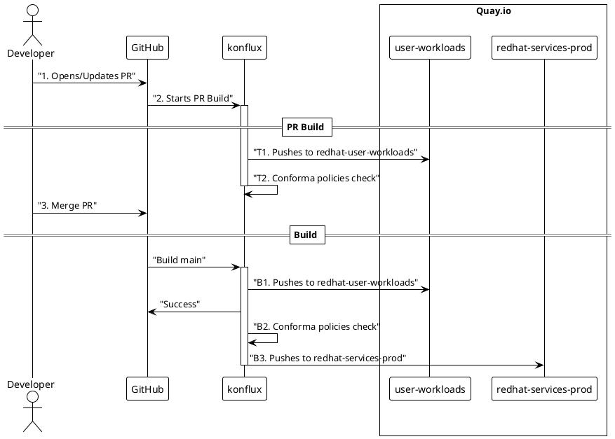
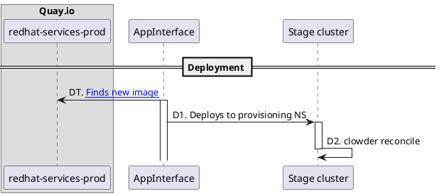

## Deployment process documentation

Commit to build

```plantuml
@startuml

!theme plain

actor "Developer" as dev
participant "GitHub" as git

' !include ./docs/diagrams/common-konflux-build.puml

dev -> git: "1. Opens/Updates PR"
git -> konflux: "2. Starts PR Build"

participant "Konflux" as konflux
box "Quay.io"
participant "user-workloads" as quayUW
participant "redhat-services-prod" as quaySProd
end box

== PR Build ==

activate konflux
konflux -> quayUW: "T1. Pushes to redhat-user-workloads"
konflux -> konflux: "T2. Conforma policies check"
deactivate konflux

' end include

dev -> git: "3. Merge PR"

== Build ==

git -> konflux: "Build main"
activate konflux
konflux -> quayUW: "B1. Pushes to redhat-user-workloads"
konflux -> git: "Success"

konflux -> konflux: "B2. Conforma policies check"
konflux -> quaySProd: "B3. Pushes to redhat-services-prod"
deactivate konflux

@enduml
```

Deploy to stage

```plantuml
@startuml
box "Quay.io"
participant "redhat-services-prod" as quaySProd
end box

participant "AppInterface" as appInterface
participant "Stage cluster" as stage

== Deployment ==
appInterface -> quaySProd: DT. [[https://gitlab.cee.redhat.com/service/app-interface/-/blob/master/data/services/insights/provisioning/deploy.yml#L127 Finds new image]]
activate appInterface
appInterface -> stage: D1. Deploys to provisioning NS
activate stage
stage -> stage: D2. clowder reconcile
deactivate stage

@enduml
```
